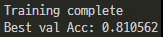
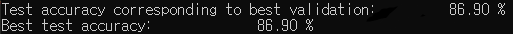

# facial-expression-recognition
Facial expression recognition on FER+ dataset using CNN(VGG16, EfficientNet-B0)
- Emotion: neutral, happiness, surprise, sadness, anger, disgust, fear, contempt


## Training

### EfficientNet-B0
To train the EfficientNet-B0:
```
python ./EfficientNet-B0/train.py -d <dataset base folder> -m crossentropy
```

### VGG13
To train the VGG13:
```
python ./VGG13/train.py -d <dataset base folder> -m crossentropy
```

## Training data
We provide a simple script generate_training_data.py in python that takes fer2013.csv and fer2013new.csv as inputs, merge both CSV files and export all the images into a png files for the trainer to process.

Please find the original FER data set here: https://www.kaggle.com/c/challenges-in-representation-learning-facial-expression-recognition-challenge/data

```
python generate_training_data.py -d <dataset base folder> -fer <fer2013.csv path> -ferplus <fer2013new.csv path>
```


## Result

### EfficientNet-B0
Best test accuracy: 81.06%




### VGG13
Best test accuracy: 86.90%




## Resources
[1] E. Barsoum, C. Zhang, C. C. Ferrer, and Z. Zhang, “FER+ : Training Deep Networks for Facial Expression Recognition with Crowd-Sourced Label Distribution.”


